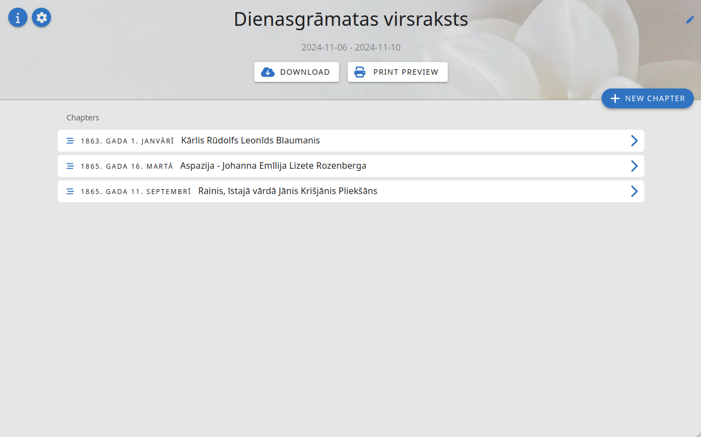

# Personal diary application (MVP)
### The main focus of this diary app is its features for printing. It allows to generate PDF files from posts, view print-preview and send pages directly to printer. Also, it allows to manage different layots for each page and other styling attributes.

### Tech stack
* PHP 8.2
* MySQL 5.7
* Doctrine ORM
* Dockerised development environment
* Does not use heavy PHP framework - minimalist Request/Service/Repository architecture with use of dependency injection (php-di)
* Vue 3 / Vite Tooling
* Vuetify 3 - UI components
* As well as some Fontawesome icons

